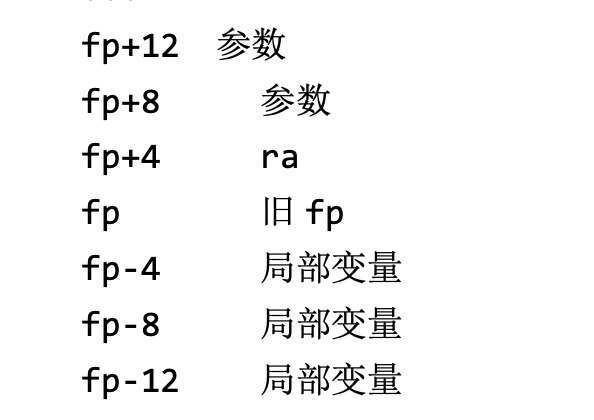

# complier

24春 北京师范大学 编译器作业


## 实验一: TinyComplier

初代编译器将 C 语言顺序语句序列翻译为等价的汇编程序，所输出的汇编 程序符合x86或MIPS汇编语言格式要求，能够被后续的汇编器翻译为可执行程 序运行。如果目标平台为 x86，则生成的可执行程序能够在目标机上执行和验证结果；如果目标平台为 MIPS，则生成的汇编程序可以在 MIPS 模拟器中运行和
验证结果。

详细的说明见`doc/Lab01WriteUp.md`

## 实验二：支持更复杂的文法处理和print

详细的说明见`doc/lab_02_write_up.md`

### 前端

- 将初代编译器的前端转化为flex
- 支持更多运算符
- 支持识别`(){}`括号嵌套
- 支持识别标准库函数`println_int`,`println_string`

### 后端

- 支持main函数作为程序入口
- 支持打印函数
- 支持更多复杂表达式求职

### 使用说明

在build文件夹下完成构建
- `make` 构建主程序
- `make test_tokenrizer` 从test文件夹下的`test_flex_rule.l`构建tokenrizer，打印解析的结果
- `make test_compile` 从test文件夹下的`test_compile.cpp`构建从给定的token编译程序的后端程序
- `sh run_cases_2.sh` 运行`test/cases_2/`文件夹下的八个测试用例，结果储存在`out/case_2`里

## 实验三

### 术语

- 调用者
- 被调用者

```sudocode
被调用者(){
    //一些定义
}

调用者(){
    被调用者();
}
```

### 我的工作

- 用bison改写后端，从c++迁移
- 支持函数定义和调用，为了支持这个功能，我们需要的工作有
    - 维护一个符号表栈和全部的符号表
        - 每当调用函数时，新建被调用者的符号表并push入符号表栈
        - 每当调用函数返回时，从符号表栈中弹出调用者的符号表
    - 创建一个enum，维护符号类型，
        - 如果是local var类型，从 fp-4n (n>0) ，即当前栈帧寻找值
        - 如果是func arg类型，从fp+4n (n>0)，即调用者压入栈，但是不在当前栈帧的地方寻找值
        
    - 在「后处理」阶段，判断每个栈帧应该有多大，增加每个函数的符号

- 增加「后处理」阶段
    - 对于每个栈帧，记录使用了多少局部变量，以维护一个合理的栈帧尺寸
    - 记录文件中出现的全部函数，在汇编程序的开始增加函数的`.globl <func name>`


    
#### fix 函数混合调用问题

```c
void myadd(int a,int b){
    return a+b;
}
int main(){
    println_int(1+myadd(114,514));
    return 0;
}

```

在这个示例程序里，我们期待的结果是629，但是

```sh
➜  build git:(main) ✗ spim -file ../out/test.asm
Loaded: /opt/homebrew/Cellar/spim/9.1.24/share/exceptions.s
742
```

感觉是由于传参规范的混乱造成的

函数调用前

```stack
- 1
- 114
- 514
```

push 114
push 514
pop push
pop push
感觉不如直接push...


push 返回值
eval add
结果在stack的顶部😠


在eval部分

```asm
# START OF EVAL

# 这里就是742了，奇怪
# t1:628
# t0:114
# 啊这，这里奇怪了
lw $t1, 4($sp)
lw $t0, 8($sp)
add $t0, $t0, $t1
sw $t0, 8($sp)
addiu $sp, $sp, 4
# END OF EVAL
```
发现传参的stack没有清理干净😠！

我们期待函数调用完的结果是

```stack
- 1
- 628
```

但是我们这里的结果是
```stack
- 1
- 114
- 628
```


#### fix 嵌套调用

据@Lucius同学说，e04和e07的问题是嵌套调用，如果`e09.c`work就能全对

```
Running testcase: ../test/cases_3/e09.c
Loaded: /opt/homebrew/Cellar/spim/9.1.24/share/exceptions.s
92
0
0
```

但是我本地的情况是e09 work？？


## 实验四

### 新功能

- 支持分支和循环关键字：if, else, while, continue, break
- 支持条件语句，分支语句
    - 条件语句 if ( condition6 ) { ... }
    - if ( condition6 ) { ... } else { ...  }
    - 循环语句 while ( condition) { ... }
    - 循环控制语句 continue; break;
- MISC: 优化？


### 支持分支-前端部分

先修改tokenrizer -> 很简单，很显然

#### 分支的语法

```
if
if (else if) x n else
```

一般必须有if，但是后面的部分都是可选的🤔

我们先迭代式修改，先支持纯if或者if-else再说，e01~e08里似乎并没有else if，所以我们简单修改parser

```
Stmt:      DeclStmt
         | AssignStmt
         | ReturnStmt 
         | StdFuncStmt 
         | FuncCallStmt
         | BranchStmt
         ;
BranchStmt : T_if '(' E ')' '{' Stmts '}' { debug_log<<"TODO: here is an if stmt"<<"\n"; }
           | T_if '(' E ')' '{' Stmts '}' T_else '(' E ')' '{' Stmts '}' { debug_log<<"TODO: here is an if stmt"<<"\n"; }
           ;
```

以e01为输入，发现输出的“伪三地址码”如下，说明简单的词法和语法识别work

```
FUNC @main:
	push 5
	pop 
assign a=
	push 3
	pop 
assign b=
	push var offset = -4
	push var offset = -8
	eval exp
	le
	push var offset = -4
	pop 
a
	pop 
print
print
TODO: here is an if stmt
	push var offset = -8
	pop 
b
	pop 
print
print
	push 0
	pop 
func declare return

```

### 支持分支-后端部分

对if语句的后端支持比较难🤔