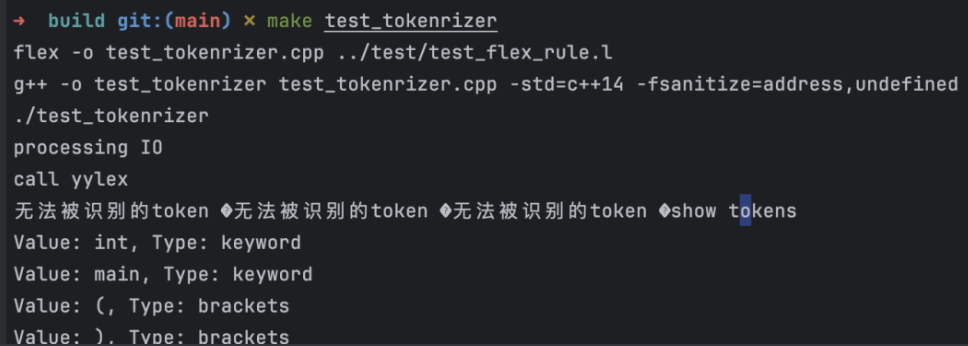

# 实验二

## 实验内容 

### 前端

- 将初代编译器的前端转化为flex
- 支持更多运算符
- 支持识别`(){}`括号嵌套
- 支持识别标准库函数`println_int`,`println_string`

### 后端

- 支持main函数作为程序入口
- 支持打印函数
- 支持更多复杂表达式求职


## 实验步骤

### 前端

首先，我学习了flex规则，主要以课程ppt和[flex官方文档](https://eternalsakura13.com/2020/05/27/flex/)为主，了解到flex的基本格式为：

```flex
%{
Declarations
%}
Definitions
%%
Rules
%%
User subroutines
```

接着我们完成了编译器的前端，我们构建了一个`flex.l`文件解析给出的例子，然后通过`printLine()`函数打印出例子，观察是否正确。其中我们发现测试用例中藏有无法显示的字符，无法通过肉眼观察发现，所以我们必须要增加匹配其他未被识别字符的一行规则



```flex
.                     {/*printf("未识别的字符 %c，ASCII 编码：%d\n", *yytext, *yytext); */ }
```


### 后端

确认前端无误之后，我们开始更新后端代码，主要是增加处理`std_function`的分支

```c++
else if(cur_line.front().type == "std_function"){
                //系统库函数
                //check and pop left bracket
                //弹出函数
                cur_line.pop_front();
                //弹出左括号
                if(cur_line.front().value!="("){
                    asm_src += "Compile Error: UB in function call";
                }
                cur_line.pop_front();
                //弹出参数
                Token val_to_print = cur_line.front();
                cur_line.pop_front();
                //暂时只处理打印int
                if(val_to_print.type!="identifier" && val_to_print.type!="constant" ){
                    asm_src += "Compile Error: println_int argument error";
                }
                if(val_to_print.type=="identifier"){
                    asm_src += "lw $a0,"; //系统函数的参数是a系列寄存器
                    auto it = std::find(sign_table.begin(), sign_table.end(),
                                        val_to_print.value);
                    if (it != sign_table.end()) {
                        int index = std::distance(sign_table.begin(), it);
                        int result = (index + 1) * -4;
                        asm_src += std::to_string(result);
                    } else {
                        asm_src += "Compile Error: Undefined Symbol";
                    }
                    asm_src += "($fp)\n";
                }else{
                    asm_src += "li $a0,";
                    asm_src += val_to_print.value;
                }
                asm_src+="li $v0, 1 # 设置系统调用号为 1，即打印整数\n"
                         "syscall # 系统调用\n"
                         "li $v0, 4 # 设置系统调用号为 4，即打印字符串\n"
                         "la $a0, newline # 准备系统调用参数\n"
                         "syscall # 系统调用\n";
                //弹出右括号
                cur_line.pop_front();
            }
```

另外，需要额外增加一个处理main函数这个程序入口的token预处理，它识别`int main(){`和`int main(int argc,int argv){`两种程序入口语法

```c++
bool process_main(std::deque<Token>* token) {
    //int main ( ) {  ->size == 5
    //int main(int argc, int argv){ size == 10
    if (!token->empty() && token->front().value == "main") {
        token->pop_front(); // 弹出 "main" token
    } else {
        return false; // "main" 不匹配，返回 false
    }

    if (!token->empty() && token->front().value == "(") {
        token->pop_front(); // 弹出 "(" token
    } else {
        return false; // "(" 不匹配，返回 false
    }

    if(!token->empty() && token->front().value == "int"){
        token->pop_front();
        if (!token->empty() &&token->front().value== "argc") {
            token->pop_front(); // 弹出 "argc" token
        }else{
            return false;
        }
        if(!token->empty() && token->front().value == ","){
            token->pop_front();
        }
        else{
            return false;
        }
        if (!token->empty() &&token->front().value== "int") {
            token->pop_front(); // 弹出 "argc" token
        }else{
            return false;
        }
        if (!token->empty() && token->front().value == "argv") {
            token->pop_front(); // 弹出 "argv" token
        } else {
            return false; // "argv" 不匹配，返回 false
        }
    }
    if (!token->empty() && token->front().value == ")") {
        token->pop_front(); // 弹出 ")" token
    } else {
        return false; // ")" 不匹配，返回 false
    }
    if (!token->empty() && token->front().value == "{") {
        token->pop_front(); // 弹出 "{" token
    } else {
        return false; // "{" 不匹配，返回 false
    }

    return true; // 所有检查通过，返回 true
}

```

特别需要指出的是，事实上我们之前的compile主体循环存在一个严重的未定义行为

```c++
while (!cur_line.empty()) {
    if(cur_line.front().value == "AAA"){//分支A
        //DO STH.
    }
    if(cur_line.front().value == "BBB"){//分支A
        //DO STH.
    }
}
```

但是如果cur_line的token已经在分支A处理完毕，则导致在第二个分支里调用空deque的front，导致**未定义行为**，所以正确的写法应该是
```c++
while (!cur_line.empty()) {
    if(cur_line.front().value == "AAA"){//分支A
        //DO STH.
    }
    else if(cur_line.front().value == "BBB"){//分支A
        //DO STH.
    }
}
```

## 实验反思与总结

在这个实验中，我们实现了简单的编译器：
- 上手flex，通过简单的正则规则匹配文法
- 学会了通过前后端分离，断点，日志等方法调试程序